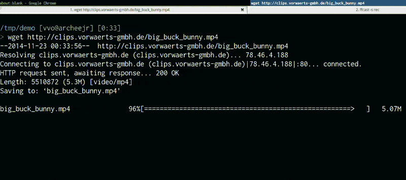

# gifify [](https://david-dm.org/vvo/gifify)

Convert any video file to an optimized animated GIF. Either in it's full length or only a part of it.

It's like [jclem/gifify](https://github.com/jclem/gifify/) but better in many ways from my point of view.

## Demo time



This screencast was recorded with [lolilolicon/FFcast](https://github.com/lolilolicon/FFcast) then converted to a GIF with:

```shell
gifify screencast.mkv -o screencast.gif --resize 800:-1
```

## Features

I believe my gifify has some features that [jclem/gifify](https://github.com/jclem/gifify/) is lacking, see:

- command line interface
- programmatic JavaScript ([Node.JS](http://nodejs.org/)) [stream](http://nodejs.org/api/stream.html) interface
- unix friendly, supports `stdin`, `stdout` & | pipes
- optimized! uses [pornel/giflossy](https://github.com/pornel/giflossy) to generate light GIFS
- lots of options: movie speed, fps, colors, compression, resize, from & to
- no temp files used, everything happens in memory
- fast!

## Requirements

Before using gifify, please install:

- [ffmpeg](http://ffmpeg.org/) [🐓🐓🐓🐓](http://en.wikipedia.org/wiki/FFmpeg#History)
- [convert](http://www.imagemagick.org/script/convert.php), the famous [ImageMagick](http://www.imagemagick.org/)
- [pornel/giflossy](https://github.com/pornel/giflossy), it's a [gifsicle](http://www.lcdf.org/gifsicle/) fork

## Installation

```shell
npm install -g gifify
```

## Command line usage

```shell
> gifify -h

Usage: gifify [options] [file]

  Options:

    -h, --help           output usage information
    -V, --version        output the version number
    --fps <n>            Frames Per Second, defaults to 10
    --from <position>    Start position, hh:mm:ss or seconds, defaults to 0
    --colors <n>         Number of colors, up to 255, defaults to 80
    --compress <n>       Compression (quality) level, from 0 (no compression) to 100, defaults to 40
    -o, --output <file>  Output file, defaults to stdout
    --resize <WxH>       Resize output, use -1 when specifying only width or height. `350x100`, `400x-1`, `-1x200`
    --speed <n>          Movie speed, defaults to 1
    --to <position>      End position, hh:mm:ss or seconds, defaults to end of movie
```

## Programmatic `Stream` usage

See the [example](./example).

```js
var fs = require('fs');
var gifify = require('gifify');
var path = require('path');

var input = path.join(__dirname, 'movie.mp4');
var output = path.join(__dirname, 'movie.gif');

var movie = fs.createReadStream(input);
var gif = fs.createWriteStream(output);

var options = {
  resize: '200:-1',
  from: 30,
  to: 35
};

gifify(movie, options, function done(err, gifReadStream) {
  if (err) {
    console.error(err);
    return;
  }

  gifReadStream.pipe(gif);
});
```

## Notes

[Giflossy](https://github.com/pornel/giflossy) is a fork of [gifsicle](www.lcdf.org/gifsicle/), gifsicle author is currently [working on](https://github.com/kohler/gifsicle/tree/lossy) integrating the lossy part in gifsicle.

So in little time we will be able to directly use gifsicle and gifiscle packages.

## Thanks

[jclem/gifify](https://github.com/jclem/gifify/) was a great source of inspiration.

